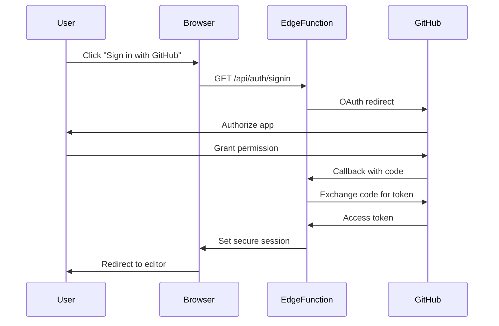

---

title: GitHub Markdown CMS Technical Architecture v2
category: projects
created: 2025-06-14
modified: 2025-06-14
tags: [cms, github, markdown, architecture, design, nextjs, pwa]
command_type: design
project: github-markdown-cms
status: active
generated_by: /plan
implements: projects/github-markdown-cms/spec-github-markdown-cms-v2.md
related_docs:

- projects/github-markdown-cms/spec-github-markdown-cms-v2.md
- projects/github-markdown-cms/plan-implementation-roadmap-v2.md
- projects/github-markdown-cms/todo-implementation-v2.md
  context_source:
- projects/github-markdown-cms/spec-github-markdown-cms-v2.md

---

# GitHub Markdown CMS Technical Architecture v2

## System Overview

The GitHub Markdown CMS v2 is architected as a Progressive Web Application (PWA) using Next.js 14 with a mobile-first, offline-first design. The system prioritizes user experience across all devices while maintaining security and performance.

## Architecture Principles

1. **Progressive Enhancement**: Core functionality works everywhere, enhanced features layer on top
2. **Mobile-First**: Every component designed for touch, then enhanced for desktop
3. **Offline-First**: Local operations by default, sync when possible
4. **Edge-First**: Compute at the edge for minimal latency
5. **Privacy-First**: Minimal data collection, user-owned content

## High-Level Architecture

```
┌─────────────────────────────────────────────────────────────────┐
│                         Client Layer                             │
├─────────────────────────────────────────────────────────────────┤
│  ┌─────────────┐  ┌──────────────┐  ┌────────────────────┐    │
│  │  PWA Shell  │  │    Lexical    │  │   Offline Queue    │    │
│  │  (Next.js)  │  │    Editor     │  │   (IndexedDB)      │    │
│  └─────────────┘  └──────────────┘  └────────────────────┘    │
│                                                                 │
│  ┌─────────────┐  ┌──────────────┐  ┌────────────────────┐    │
│  │   Zustand   │  │ React Query  │  │  Service Worker    │    │
│  │   Store     │  │    Cache     │  │   (Workbox)        │    │
│  └─────────────┘  └──────────────┘  └────────────────────┘    │
└─────────────────────────────────────────────────────────────────┘
                                │
                                │ HTTPS
                                ▼
┌─────────────────────────────────────────────────────────────────┐
│                          Edge Layer                             │
├─────────────────────────────────────────────────────────────────┤
│  ┌─────────────┐  ┌──────────────┐  ┌────────────────────┐    │
│  │  Next.js    │  │   NextAuth   │  │    API Routes      │    │
│  │  Edge RT    │  │   (Auth.js)  │  │   (Edge Funcs)     │    │
│  └─────────────┘  └──────────────┘  └────────────────────┘    │
│                                                                 │
│  ┌─────────────┐  ┌──────────────┐  ┌────────────────────┐    │
│  │   Caching   │  │   Rate       │  │    Image           │    │
│  │   Layer     │  │   Limiter    │  │   Optimizer        │    │
│  └─────────────┘  └──────────────┘  └────────────────────┘    │
└─────────────────────────────────────────────────────────────────┘
                                │
                                │ HTTPS
                                ▼
┌─────────────────────────────────────────────────────────────────┐
│                       External Services                         │
├─────────────────────────────────────────────────────────────────┤
│  ┌─────────────┐  ┌──────────────┐  ┌────────────────────┐    │
│  │  GitHub     │  │   LiteLLM    │  │    Analytics       │    │
│  │  REST/GQL   │  │   Providers  │  │   (Plausible)      │    │
│  └─────────────┘  └──────────────┘  └────────────────────┘    │
└─────────────────────────────────────────────────────────────────┘
```

## Component Architecture

### Frontend Components

```typescript
// Component Structure
src/
├── app/                    # Next.js App Router
│   ├── (auth)/            # Authenticated routes
│   ├── (public)/          # Public routes
│   ├── api/               # API routes
│   └── demo/              # Demo mode
├── components/            # Shared UI components
│   ├── Editor/           # Lexical editor
│   ├── Mobile/           # Mobile-specific
│   └── Common/           # Shared components
├── features/             # Feature modules
│   ├── auth/            # Authentication
│   ├── editor/          # Editor logic
│   ├── github/          # GitHub integration
│   ├── media/           # Image handling
│   ├── offline/         # Offline support
│   └── vim/             # Vim mode
├── lib/                  # Core utilities
│   ├── api/             # API clients
│   ├── hooks/           # Custom hooks
│   └── utils/           # Helpers
└── stores/              # State management
    ├── auth.ts          # Auth state
    ├── editor.ts        # Editor state
    └── sync.ts          # Sync state
```

### State Management Architecture

```typescript
// Zustand store with persistence
interface AppState {
  // Auth State
  auth: {
    user: User | null;
    session: Session | null;
    isAuthenticated: boolean;
  };

  // Editor State
  editor: {
    activeFile: Post | null;
    content: string;
    isDirty: boolean;
    vimMode: VimLevel;
    theme: Theme;
  };

  // Repository State
  repository: {
    current: Repository | null;
    branch: string;
    files: FileNode[];
    cache: Map<string, CachedFile>;
  };

  // Sync State
  sync: {
    queue: SyncOperation[];
    status: 'idle' | 'syncing' | 'error';
    lastSync: Date | null;
    conflicts: Conflict[];
  };

  // UI State
  ui: {
    sidebarOpen: boolean;
    commandPaletteOpen: boolean;
    previewMode: 'side' | 'tab' | 'hidden';
    mobileMenuOpen: boolean;
  };
}

// React Query for server state
const queryClient = new QueryClient({
  defaultOptions: {
    queries: {
      staleTime: 5 * 60 * 1000, // 5 minutes
      cacheTime: 10 * 60 * 1000, // 10 minutes
      retry: 3,
      retryDelay: (attemptIndex) => Math.min(1000 * 2 ** attemptIndex, 30000),
    },
  },
});
```

## Data Flow Architecture

### Read Path

```
User Action → React Component → React Query → API Route → GitHub API
     ↓                                ↓
Local State ← Cache Update ← Response Transform
```

### Write Path

```
User Edit → Editor State → Debounce → IndexedDB → Sync Queue
                                           ↓
                                    Background Sync → GitHub API
                                           ↓
                                    Conflict Detection → UI
```

### Offline Sync Architecture

```typescript
class OfflineSync {
  private queue: Dexie.Table<SyncOperation>;
  private worker: ServiceWorker;

  async addOperation(op: SyncOperation) {
    // Add to IndexedDB queue
    await this.queue.add({
      ...op,
      timestamp: Date.now(),
      retries: 0,
      status: 'pending',
    });

    // Try immediate sync if online
    if (navigator.onLine) {
      this.processQueue();
    }
  }

  async processQueue() {
    const pending = await this.queue.where('status').equals('pending').toArray();

    for (const op of pending) {
      try {
        await this.executeOperation(op);
        await this.queue.update(op.id, { status: 'completed' });
      } catch (error) {
        if (isConflict(error)) {
          await this.handleConflict(op, error);
        } else {
          await this.retryLater(op);
        }
      }
    }
  }
}
```

## Security Architecture

### Authentication Flow



### Security Layers

1. **Client Security**

   ```typescript
   // Content Security Policy
   const csp = {
     'default-src': ["'self'"],
     'script-src': ["'self'", "'unsafe-inline'", "'unsafe-eval'"],
     'style-src': ["'self'", "'unsafe-inline'"],
     'img-src': ["'self'", 'data:', 'https:'],
     'connect-src': ["'self'", 'https://api.github.com'],
   };
   ```

2. **Edge Security**

   ```typescript
   // Session encryption
   const sessionOptions = {
     password: process.env.SESSION_SECRET,
     cookieName: 'github-cms-session',
     cookieOptions: {
       secure: true,
       httpOnly: true,
       sameSite: 'lax',
       maxAge: 60 * 60 * 24 * 7, // 1 week
     },
   };
   ```

3. **API Security**
   ```typescript
   // Rate limiting
   const rateLimiter = new RateLimiter({
     windowMs: 15 * 60 * 1000, // 15 minutes
     max: 100, // limit each IP to 100 requests per windowMs
     standardHeaders: true,
     legacyHeaders: false,
   });
   ```

## Performance Architecture

### Code Splitting Strategy

```typescript
// Route-based splitting
const Editor = dynamic(() => import('@/features/editor'), {
  loading: () => <EditorSkeleton />,
  ssr: false,
});

// Feature-based splitting
const VimMode = dynamic(() => import('@/features/vim'), {
  loading: () => null,
  ssr: false,
});

// Heavy library splitting
const MarkdownPreview = dynamic(() => import('@/components/Preview'), {
  loading: () => <PreviewSkeleton />,
  ssr: false,
});
```

### Caching Strategy

```typescript
// Multi-layer caching
class CacheManager {
  // L1: Memory cache (fast, small)
  private memory = new Map<string, CachedItem>();

  // L2: IndexedDB (slower, larger)
  private db = new Dexie('github-cms-cache');

  // L3: Service Worker cache (network fallback)
  private sw = navigator.serviceWorker;

  async get(key: string): Promise<any> {
    // Check memory first
    if (this.memory.has(key)) {
      return this.memory.get(key);
    }

    // Check IndexedDB
    const dbItem = await this.db.cache.get(key);
    if (dbItem && !this.isStale(dbItem)) {
      this.memory.set(key, dbItem);
      return dbItem;
    }

    // Fallback to network
    return null;
  }
}
```

### Image Optimization Pipeline

```typescript
class ImageOptimizer {
  async optimize(file: File): Promise<OptimizedImage> {
    // Resize if needed
    const resized = await this.resize(file, {
      maxWidth: 2048,
      maxHeight: 2048,
      maintainAspect: true,
    });

    // Convert to WebP if supported
    const converted = await this.convert(resized, {
      format: this.supportsWebP() ? 'webp' : 'jpeg',
      quality: 0.85,
    });

    // Generate responsive sizes
    const sizes = await Promise.all([
      this.generateSize(converted, 320), // Mobile
      this.generateSize(converted, 768), // Tablet
      this.generateSize(converted, 1920), // Desktop
    ]);

    return {
      original: converted,
      sizes,
      blurhash: await this.generateBlurhash(converted),
    };
  }
}
```

## Mobile Architecture

### Touch Gesture System

```typescript
class GestureManager {
  private hammer: HammerManager;

  setupGestures(element: HTMLElement) {
    this.hammer = new Hammer(element);

    // Swipe navigation
    this.hammer.on('swiperight', () => {
      store.ui.sidebarOpen = true;
    });

    this.hammer.on('swipeleft', () => {
      store.ui.previewMode = 'side';
    });

    // Pinch zoom for preview
    this.hammer.get('pinch').set({ enable: true });
    this.hammer.on('pinch', (e) => {
      store.ui.previewZoom = e.scale;
    });
  }
}
```

### Mobile-Specific Components

```typescript
// Bottom sheet for mobile actions
export function MobileBottomSheet() {
  const [expanded, setExpanded] = useState(false);
  const dragProps = useDrag({
    onDrag: (state) => {
      if (state.offset[1] > 100) {
        setExpanded(false);
      }
    },
  });

  return (
    <div className="fixed bottom-0 left-0 right-0 md:hidden" {...dragProps}>
      <div className="bg-white rounded-t-xl shadow-lg p-4">
        <MobileToolbar />
        {expanded && <MobileActions />}
      </div>
    </div>
  );
}
```

## Testing Architecture

### Test Pyramid

```
                 ┌─────┐
                 │ E2E │ 10%
              ┌──┴─────┴──┐
              │Integration│ 30%
          ┌───┴───────────┴───┐
          │   Unit Tests      │ 60%
          └───────────────────┘
```

### Testing Strategy

```typescript
// Unit test example
describe('ImageOptimizer', () => {
  it('should resize large images', async () => {
    const file = new File(['...'], 'test.jpg', { type: 'image/jpeg' });
    const optimizer = new ImageOptimizer();
    const result = await optimizer.optimize(file);

    expect(result.original.width).toBeLessThanOrEqual(2048);
  });
});

// Integration test example
describe('GitHub Sync', () => {
  it('should handle conflicts gracefully', async () => {
    const { result } = renderHook(() => useGitHubSync());

    // Simulate conflict
    mockAPI.simulateConflict();

    await act(async () => {
      await result.current.push();
    });

    expect(result.current.conflicts).toHaveLength(1);
  });
});

// E2E test example
test('Mobile user can create post', async ({ page, isMobile }) => {
  await page.goto('/');
  await page.click('text=Try Demo');

  // Mobile-specific interactions
  await page.locator('.mobile-toolbar').click();
  await page.type('.editor', '# Mobile Post');

  await expect(page.locator('.preview')).toContainText('Mobile Post');
});
```

## Deployment Architecture

### Infrastructure

```yaml
# vercel.json
{
  'functions': { 'app/api/*/route.ts': { 'runtime': 'edge', 'regions': ['iad1', 'sfo1', 'lhr1'] } },
  'images':
    {
      'domains': ['github.com', 'raw.githubusercontent.com'],
      'deviceSizes': [320, 640, 768, 1024, 1280, 1920],
      'imageSizes': [16, 32, 48, 64, 96, 128, 256],
    },
  'headers':
    [
      {
        'source': '/(.*)',
        'headers':
          [
            { 'key': 'X-Content-Type-Options', 'value': 'nosniff' },
            { 'key': 'X-Frame-Options', 'value': 'DENY' },
          ],
      },
    ],
}
```

### Monitoring & Observability

```typescript
// Error tracking
Sentry.init({
  dsn: process.env.NEXT_PUBLIC_SENTRY_DSN,
  environment: process.env.NODE_ENV,
  integrations: [
    new Sentry.BrowserTracing(),
    new Sentry.Replay({
      maskAllText: true,
      blockAllMedia: true,
    }),
  ],
  tracesSampleRate: 0.1,
  replaysSessionSampleRate: 0.1,
  replaysOnErrorSampleRate: 1.0,
});

// Performance monitoring
export function reportWebVitals(metric: NextWebVitalsMetric) {
  // Send to analytics
  analytics.track('web-vitals', {
    name: metric.name,
    value: Math.round(metric.value),
    label: metric.id,
  });

  // Log to console in dev
  if (process.env.NODE_ENV === 'development') {
    console.log(metric);
  }
}
```

## Scalability Considerations

### Horizontal Scaling

- **Static Assets**: CDN automatically scales
- **API Routes**: Edge functions scale to demand
- **Image Optimization**: On-demand ISR caching

### Performance Budgets

```javascript
// webpack.config.js
module.exports = {
  performance: {
    maxAssetSize: 200000, // 200KB
    maxEntrypointSize: 250000, // 250KB
    hints: 'error',
  },
};
```

### Growth Planning

1. **10x Users**: Current edge architecture handles
2. **100x Users**: Add Redis for session state
3. **1000x Users**: Consider regional deployments

## Future Architecture Considerations

### Potential Enhancements

1. **Real-time Collaboration**: Y.js CRDT integration
2. **AI Features**: Edge-deployed models
3. **Plugin System**: Sandboxed iframe architecture
4. **Desktop App**: Tauri wrapper with native features

### Technical Debt Prevention

1. **Strict TypeScript**: No any types allowed
2. **Component Standards**: Documented patterns
3. **Performance Budget**: Automated checks
4. **Dependency Management**: Monthly updates

This architecture provides a solid foundation for a modern, performant, and user-friendly CMS that works seamlessly across all devices and network conditions.
